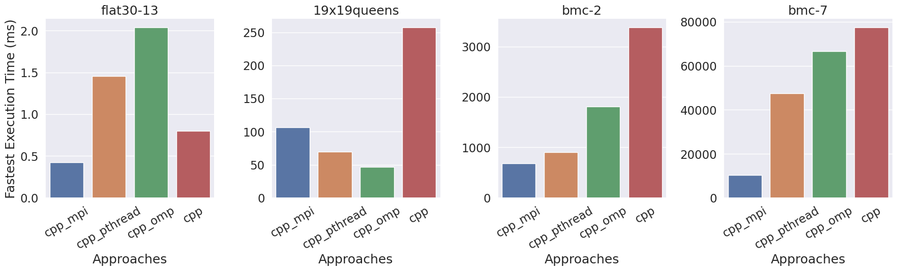

# TeamSAT - A Collaborative Parallel SAT Solver

[](https://dl.circleci.com/status-badge/redirect/circleci/HfTjEcrsmpvej1LDoGF5Bf/GgUZ44dUkHFwdneXqiRATu/tree/main)

[ME/CS/ECE 759: High Performance Computing for Engineering Applications](https://sbel.wisc.edu/me-964-high-performance-computing-for-engineering-applications/)

Fall 2023 | Final Project

Authors: [Fariha](https://github.com/farihat13) and [Tareq](https://github.com/tareqmahmood)

Final Report: [Read](resources/TeamSAT.pdf)

## Abstract

The SAT problem involves determining the satisfiability of logical formulas, crucial in diverse applications such as artificial intelligence, cryptography, and optimization. The [CDCL algorithm](https://en.wikipedia.org/wiki/Conflict-driven_clause_learning), a cornerstone of modern SAT solvers, employs conflict analysis and dynamic clause learning to efficiently navigate the SAT problem. Recognizing the computational complexity of SAT, the study explores parallelization strategies using MPI, PThread, and OpenMP. The MPI approach, involving multi-node concurrent solvers who share learned clauses, exhibits superior performance, particularly in handling larger problem instances. The impact of parallelism is evident across varying problem sizes, with optimal configurations depending on problem characteristics. The results showcase the scalability and efficiency of parallel SAT solvers, emphasizing their significance in addressing real-world challenges. 

## Test Cases

|  Test Case  | # Variables | # Clauses |
|:-----------:|:-----------:|:---------:|
|  flat30-13  |      90     |    300    |
| 19x19queens |     361     |   10735   |
|    bmc-2    |     2810    |   11683   |
|    bmc-7    |     8710    |   39774   |

## A 30000 Foot View of The Results



TeamSAT is the nickname for `cpp_mpi`.

## Folder structure

### Dataset Folder

- 📂 test_cases
    - 📄 flat30-13.cnf
    - 📄 19x19queens.cnf
    - 📄 bmc-2.cnf
    - 📄 bmc-7.cnf

### Code Folders

- 📂 cpp
  - 📄 sat_solver.cpp
  - 📄 run.sh
  - 📄 slurm-build.sh
  - 📄 slurm-run.sh
- 📂 cpp_mpi
  - 📄 sat_solver.cpp
  - 📄 ...
- 📂 cpp_omp
  - 📄 sat_solver.cpp
  - 📄 ...
- 📂 cpp_pthread
  - 📄 sat_solver.cpp
  - 📄 ...

### Benchmark Folder

- 📂 benchmark


## Building & Running the Project

### Baseline

**CodeFile:** `cpp/sat_solver.cpp`

**Script to run:** `cpp/run.sh`, `cpp/slurm-build.sh`, `cpp/slurm-run.sh`

**Example commands to run in your machine:**

```bash
$ cd cpp/
$ ./run.sh ../test_cases/flat30-13.cnf
$ ./run.sh ../test_cases/19x19queens.cnf
$ ./run.sh ../test_cases/bmc-2.cnf
$ ./run.sh ../test_cases/bmc-7.cnf
```
**Example commands to run in slurm:**

```bash
$ cd cpp/
$ sbatch slurm-build.sh
$ sbatch slurm-run.sh
$ cat output.txt
```
To change the test_case, edit the `slurm-run.sh`.

### CPP_MPI

**CodeFile:** `cpp_mpi/sat_solver.cpp`

**Script to run:** `cpp_mpi/run.sh`, `cpp_mpi/slurm-build.sh`, `cpp_mpi/slurm-run.sh`

**Example commands to run in your machine:**

```bash
$ cd cpp_mpi/
$ ./run.sh ../test_cases/flat30-13.cnf
$ ./run.sh ../test_cases/19x19queens.cnf
$ ./run.sh ../test_cases/bmc-2.cnf
$ ./run.sh ../test_cases/bmc-7.cnf
```
**Example commands to run in slurm:**

```bash
$ cd cpp_mpi/
$ sbatch slurm-build.sh
$ sbatch slurm-run.sh
$ cat output.txt
```
To change the test_case, edit the `slurm-run.sh`.


### CPP_OMP

**CodeFile:** `cpp_omp/sat_solver.cpp`

**Script to run:** `cpp_omp/run.sh`, `cpp_omp/slurm-build.sh`, `cpp_omp/slurm-run.sh`

**Example commands to run in your machine:**

```bash
$ cd cpp_omp/
$ ./run.sh ../test_cases/flat30-13.cnf 4
$ ./run.sh ../test_cases/19x19queens.cnf 4
$ ./run.sh ../test_cases/bmc-2.cnf 4
$ ./run.sh ../test_cases/bmc-7.cnf 4
```
[**Note**: 4 is the number of threads]

**Example commands to run in slurm:**

```bash
$ cd cpp_omp/
$ sbatch slurm-build.sh
$ sbatch slurm-run.sh
$ cat output.txt
```
To change the test_case, edit the `slurm-run.sh`.

### CPP_PThread

**CodeFile:** `cpp_pthread/sat_solver.cpp`

**Script to run:** `cpp_pthread/run.sh`, `cpp_pthread/slurm-build.sh`, `cpp_pthread/slurm-run.sh`

**Example commands to run in your machine:**

```bash
$ cd cpp_pthread/
$ ./run.sh ../test_cases/flat30-13.cnf 4
$ ./run.sh ../test_cases/19x19queens.cnf 4
$ ./run.sh ../test_cases/bmc-2.cnf 4
$ ./run.sh ../test_cases/bmc-7.cnf 4
```
[**Note**: 4 is the number of threads]


**Example commands to run in slurm:**

```bash
$ cd cpp_pthread/
$ sbatch slurm-build.sh
$ sbatch slurm-run.sh
$ cat output.txt
```
To change the test_case, edit the `slurm-run.sh`.


## Future Directions
* Implement the most efficient single-threaded version, then parallelize it.
* Lots of profiling on lots of datasets.


## Credits
* Vanilla `C++` is inspired from [CDCL in Python for babies](https://github.com/apurva91/SAT-Solver). Hence this repository is for *teens*.
* Dan Negrut for this awesome course, providing access to [Euler](https://wacc.wisc.edu/infrastructure/) compute cluster.
